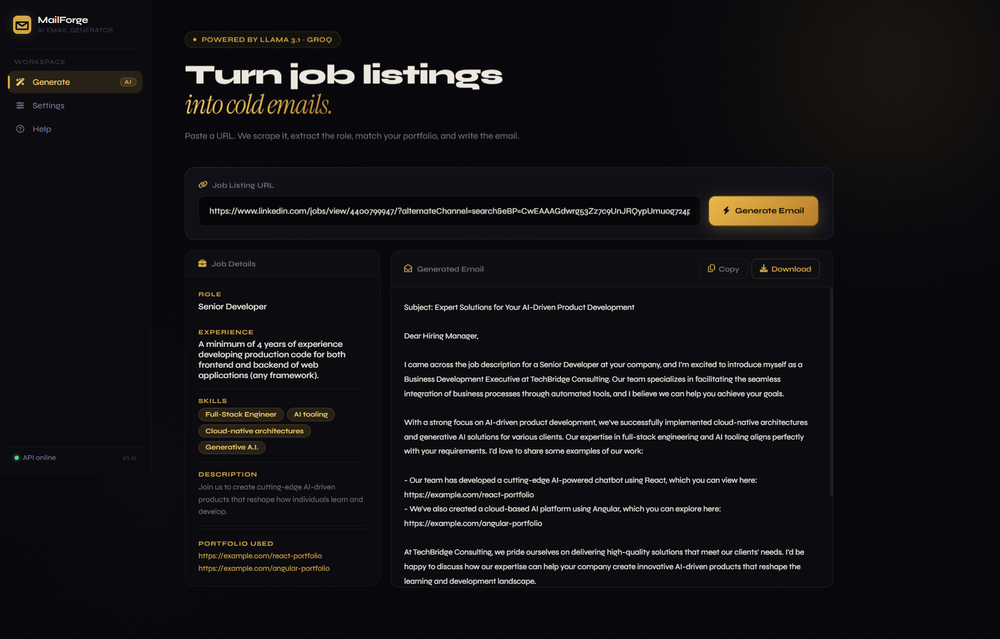

<div align="center">

# ✉️ MailForge
### AI-Powered Cold Email Generator

[](https://python.org)
[](https://fastapi.tiangolo.com)
[](https://langchain.com)
[](https://groq.com)
[](https://vercel.com)
[](https://render.com)
[](LICENSE)

**Paste a job listing URL. Get a personalised cold email in seconds.**

[🚀 Live Demo](#-live-demo) • [⚙️ Setup](#%EF%B8%8F-local-setup) • [🌍 Deploy](#-deployment) • [📖 Docs](#-documentation)

---

</div>

## 🎯 What Is This?

**MailForge** is a full-stack AI application that automates B2B cold email outreach.

When a company posts a job listing, it signals a need — they're hiring because they have a gap. MailForge reads that signal, extracts what they need, and writes a targeted cold email offering your services. No copy-pasting. No manual research. Just a URL and a send-ready email.

> **Business Use Case:** A software consulting firm wants to pitch to Nike, who just posted a job for a Machine Learning Engineer. Instead of writing from scratch, a sales executive pastes the URL into MailForge — and gets a personalised outreach email with matched portfolio links in seconds.

---

## ✨ Features

| Feature | Description |
|---|---|
| 🔗 **URL-to-Email Pipeline** | Paste any job listing URL — get a send-ready cold email |
| 🤖 **AI Extraction** | LLaMA 3.1 extracts role, skills, experience, and description as structured JSON |
| 📁 **Portfolio Matching** | Automatically matches your portfolio projects to the job's required skills |
| 🌐 **3-Strategy Scraping** | Requests → Selenium → WebBaseLoader fallback chain for maximum compatibility |
| ⚙️ **Company Settings** | Fully customisable sender name, company, and description — persisted in session |
| 🎨 **Premium Dark UI** | Multi-page SaaS-level interface with smooth page transitions and micro-interactions |
| 🔒 **Secure by Design** | API keys backend-only, CORS restricted, input validation via Pydantic |
| 📊 **Live API Status** | Real-time backend health indicator in the sidebar |
| 📋 **Copy & Download** | One-click copy or download of every generated email |

---

## 🧠 How It Works

```
┌─────────────────────────────────────────────────────────────┐
│                        USER BROWSER                          │
│                  (Vercel · Static Frontend)                  │
└──────────────────────────┬──────────────────────────────────┘
                           │  HTTPS  POST /api/generate
┌──────────────────────────▼──────────────────────────────────┐
│                     FASTAPI BACKEND                          │
│                   (Render · Python API)                      │
│                                                              │
│  ┌─────────────┐   ┌──────────────────┐   ┌─────────────┐  │
│  │   Scraper   │──▶│   LLM Service    │──▶│  Portfolio  │  │
│  │             │   │                  │   │  Service    │  │
│  │ 1. requests │   │ 1. Extract jobs  │   │             │  │
│  │ 2. Selenium │   │    (JSON output) │   │ Keyword     │  │
│  │ 3. Loader   │   │ 2. Write email   │   │ matching vs │  │
│  └─────────────┘   └────────┬─────────┘   │ portfolio   │  │
│                             │             │ CSV         │  │
└─────────────────────────────│─────────────└─────────────┘──┘
                              │  LLM API call
┌─────────────────────────────▼──────────────────────────────┐
│                        GROQ API                             │
│                   LLaMA 3.1 8B Instant                      │
└─────────────────────────────────────────────────────────────┘
```

**Step-by-step flow:**

1. User pastes a job listing URL and clicks **Generate Email**
2. Frontend sends `POST /api/generate` to the FastAPI backend
3. Backend scrapes the page (tries 3 strategies for maximum reliability)
4. Raw HTML is cleaned and truncated to fit the LLM context window
5. LLaMA 3.1 extracts structured job data (role, skills, experience, description)
6. Job skills are matched against `data/portfolio.csv` to find the most relevant projects
7. LLaMA 3.1 writes a personalised cold email referencing the job and matched portfolio
8. The email, job details, and portfolio links are returned to the frontend
9. User copies or downloads the result

---

## 📸 Screenshots

### 🏠 Generate Page — Main Email Generator
> The core workspace. Paste a URL, hit Generate, and watch the AI pipeline run in real time. Results show extracted job details on the left and the generated email on the right.



---

### ⚙️ Settings Page — Company Configuration
> Configure your company name, your name, description, and optional portfolio link overrides. Settings persist in session storage — set once, use everywhere.


---

### ❓ Help Page — Setup & Troubleshooting
> Step-by-step how-it-works guide, prerequisites checklist, and a troubleshooting reference table.


> 📌 **To add real screenshots:** Run the app locally, take screenshots of each page, save them to `docs/screenshots/`, and replace the image paths above.

---

## 🛠️ Tech Stack

### Frontend
| Tech | Purpose |
|---|---|
| Vanilla JS (ES2022) | Client-side logic, routing, API calls |
| HTML5 / CSS3 | Markup and premium dark UI styling |
| Syne + Instrument Serif | Typography (Google Fonts) |
| Font Awesome 6 | Icons |

### Backend
| Tech | Purpose |
|---|---|
| FastAPI | REST API framework with automatic docs |
| Pydantic v2 | Request/response validation |
| Uvicorn | ASGI server |
| LangChain 0.2 | LLM orchestration and prompt chaining |
| LangChain-Groq | Groq API integration |
| Requests + Selenium | Web scraping (strategy 1 & 2) |
| WebBaseLoader | Web scraping fallback (strategy 3) |
| Pandas | Portfolio CSV parsing |
| python-dotenv | Environment variable management |

### AI / APIs
| Tech | Purpose |
|---|---|
| Groq | Ultra-fast LLM inference API |
| LLaMA 3.1 8B Instant | Job extraction + email generation |

### DevOps / Deployment
| Tech | Purpose |
|---|---|
| Vercel | Frontend hosting (static files) |
| Render | Backend hosting (Python/FastAPI) |
| GitHub | Source control + CI trigger |

---

## ⚙️ Local Setup

### Prerequisites
- Python 3.11+
- A free Groq API key → [console.groq.com/keys](https://console.groq.com/keys)

### 1. Clone the repository
```bash
git clone https://github.com/YOUR_USERNAME/mailforge.git
cd mailforge
```

### 2. Create a virtual environment
```bash
# Windows
py -3.11 -m venv venv
venv\Scripts\activate

# macOS / Linux
python3 -m venv venv
source venv/bin/activate
```

### 3. Install dependencies
```bash
pip install -r requirements.txt
```

### 4. Configure environment variables
```bash
cp .env.example .env
```

Open `.env` and fill in at minimum:
```env
GROQ_API_KEY=your_key_here
COMPANY_NAME=Your Company
FOUNDER_NAME=Your Name
```

### 5. Customise your portfolio
Edit `data/portfolio.csv` with your real project links:
```csv
Techstack,Links
"Python, Django, FastAPI",https://github.com/you/your-project
"Machine Learning, TensorFlow",https://your-ml-project.com
```

### 6. Run the app
```bash
# Single command — starts both API + frontend + opens browser
python run.py
```

| Service | URL |
|---|---|
| Frontend | http://localhost:8080 |
| API | http://localhost:8000 |
| API Docs | http://localhost:8000/docs |

---

## 🌍 Deployment

MailForge uses a **Vercel + Render** split deployment:

- **Frontend** (HTML/CSS/JS) → **Vercel** — free, instant, zero config
- **Backend** (FastAPI) → **Render** — free tier, Python support, auto-deploys

### Step 1 — Push to GitHub
```bash
git init
git add .
git commit -m "feat: initial MailForge commit"
git branch -M main
git remote add origin https://github.com/YOUR_USERNAME/mailforge.git
git push -u origin main
```

### Step 2 — Deploy Backend to Render

1. Go to [render.com](https://render.com) → **New +** → **Web Service**
2. Connect your GitHub repo
3. Render detects `render.yaml` automatically — click **Apply**
4. Add environment variables in the Render dashboard:
   - `GROQ_API_KEY` → your Groq key
   - `ALLOWED_ORIGINS` → (fill in after Step 3)
5. Click **Deploy** — copy the URL: `https://mailforge-api.onrender.com`

### Step 3 — Configure Frontend API URL

Open `frontend/config.js` and replace the placeholder:
```js
window.MAILFORGE_CONFIG = {
  API_URL: "https://mailforge-api.onrender.com"  // ← your actual Render URL
};
```

Then commit and push:
```bash
git add frontend/config.js
git commit -m "config: set production API URL"
git push
```

### Step 4 — Deploy Frontend to Vercel

1. Go to [vercel.com](https://vercel.com) → **Add New Project**
2. Import your GitHub repo
3. Vercel detects `vercel.json` — no config needed
4. Click **Deploy** — copy the URL: `https://mailforge.vercel.app`

### Step 5 — Update CORS on Render

Go to Render dashboard → your service → **Environment** and update:
```
ALLOWED_ORIGINS = https://mailforge.vercel.app
```

Click **Save** → Render redeploys automatically. ✅

---

## 🧪 Running Tests

```bash
pytest
# or with coverage:
pytest --cov=app --cov-report=term-missing
```

Expected: **15 tests passing**

---

## 📌 Future Improvements

- [ ] **ChromaDB vector search** — replace keyword matching with semantic portfolio search
- [ ] **Multi-job support** — generate emails for all jobs found on a page
- [ ] **Email history** — save and revisit previously generated emails
- [ ] **Tone selector** — formal / casual / aggressive outreach styles
- [ ] **Export to Gmail/Outlook** — one-click mailto or OAuth send
- [ ] **Analytics dashboard** — track which emails got responses

---

## 📖 Documentation

Full technical documentation available in [`docs/MailForge_Documentation.docx`](docs/MailForge_Documentation.docx)

---

## 📄 License

MIT — see [LICENSE](LICENSE).

---

<div align="center">

Built with ☕ and LLaMA 3.1 by **Samridhi Gupta**

</div>
